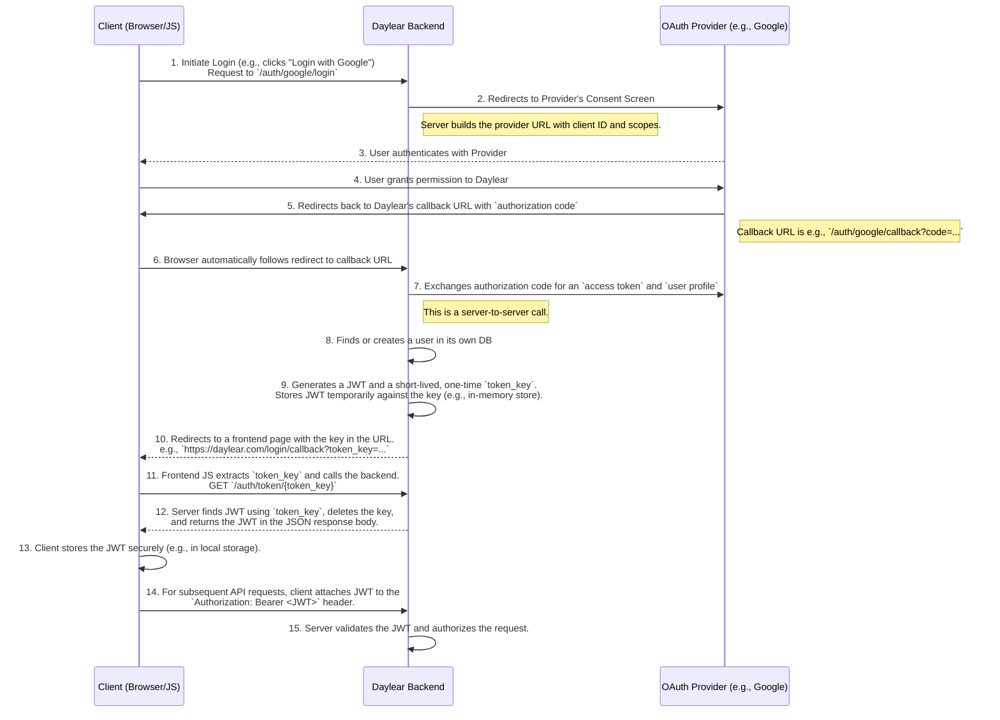

## Architecture Overview


## Authentication Flow

The application uses an OAuth2 flow for authentication. Here is the step-by-step process for how a user authenticates and receives a JWT.



### How to Get a Token for Local Testing

1.  **Start the Application**: Ensure the backend server and frontend dev server are running.
2.  **Initiate Login**: In your browser, navigate to the OAuth login URL, for example: `http://localhost:8080/auth/google/login`.
3.  **Authenticate with Provider**: Log in on the provider's site (e.g., Google).
4.  **Monitor Network Requests**: After you grant permission, the provider will redirect back to the Daylear backend. The backend will then redirect to the frontend.
    *   Open your browser's developer tools and go to the **Network** tab.
    *   The browser will be redirected to a URL like `http://localhost:5173/login/callback?token_key=xxxxxxxx`.
    *   Immediately after this redirect, you will see a `fetch`/`XHR` request from the frontend javascript to `http://localhost:8080/auth/token/xxxxxxxx`.
5.  **Capture the JWT**:
    *   Click on the request to `/auth/token/xxxxxxxx` in the Network tab.
    *   Look at the **Response** or **Preview** tab for that request.
    *   The raw JWT will be in the JSON response body. Copy it. You can now use this as a Bearer token for your API requests.

## Database Schema

The database is designed around four core entities—users, circles, recipes, and ingredients—with their relationships managed through several join tables.

### Core Entities

*   **`daylear_user`**: This table holds all user-specific information, including credentials for authentication (`Email`, `Username`) and personal details (`GivenName`, `FamilyName`).
*   **`circle`**: Represents a social group, such as family or friends. Each circle has a `Title` and a boolean `IsPublic` to control its visibility.
*   **`recipe`**: Contains all the data for a single recipe, including `Title`, `Description`, `Directions` (stored as JSONB), and a URI for an associated image.
*   **`ingredient`**: A simple lookup table for all available ingredients, identified by `Title`.

### Relationships and Join Tables

The core entities are connected through the following many-to-many relationships, each facilitated by a dedicated join table:

*   **`circle_user`**: Connects the `daylear_user` and `circle` tables, establishing which users are members of which circles. It includes a `PermissionLevel` to define a user's role or access rights within a circle.
*   **`recipe_user`**: Connects the `recipe` and `daylear_user` tables. This table manages which users have access to specific recipes, also governed by a `PermissionLevel`.
*   **`recipe_circle`**: Connects the `recipe` and `circle` tables, allowing a recipe to be shared with all members of a circle. Access rights are defined by `PermissionLevel`.
*   **`recipe_ingredient`**: Connects the `recipe` and `ingredient` tables. It specifies the `MeasurementAmount` and `MeasurementType` for each ingredient required in a recipe.

This schema allows for a flexible and granular permission model for sharing recipes among users and circles.

Below is a diagram that visually represents these relationships.

```mermaid
erDiagram
    daylear_user {
        bigint user_id PK
        varchar(255) email
        varchar(50) username
        varchar(100) given_name
        varchar(100) family_name
    }
    circle {
        bigint circle_id PK
        varchar title
        boolean is_public
    }
    recipe {
        bigint recipe_id PK
        varchar title
        varchar description
        jsonb directions
        varchar image_uri
        jsonb ingredient_groups
    }
    ingredient {
        bigint ingredient_id PK
        varchar title
    }
    circle_user {
        bigint circle_user_id PK
        bigint circle_id FK
        bigint user_id FK
        int permission_level
    }
    recipe_user {
        bigint recipe_user_id PK
        bigint recipe_id FK
        bigint user_id FK
        int permission_level
    }
    recipe_circle {
        bigint recipe_circle_id PK
        bigint recipe_id FK
        bigint circle_id FK
        int permission_level
    }
    recipe_ingredient {
        bigint recipe_ingredient_id PK
        bigint recipe_id FK
        bigint ingredient_id FK
        float64 measurement_amount
        int measurement_type
    }

    daylear_user ||--o{ circle_user : "has"
    circle ||--o{ circle_user : "has"
    daylear_user ||--o{ recipe_user : "has"
    recipe ||--o{ recipe_user : "has"
    circle ||--o{ recipe_circle : "has"
    recipe ||--o{ recipe_circle : "has"
    recipe ||--o{ recipe_ingredient : "has"
    ingredient ||--o{ recipe_ingredient : "has"
}
```

## API Cookbook

This section provides a collection of working `curl` examples for common API endpoints.

### CreateRecipeAccess

Grants a user or circle access to a specific recipe.

**Endpoint:** `POST /meals/v1alpha1/{parent=recipes/*}/accesses`

**Example Request:**
Grants user with ID `2` WRITE access to recipe with ID `1`.

```bash
curl -X POST \
  -H "Authorization: Bearer <YOUR_JWT>" \
  -H "Content-Type: application/json" \
  -d '{"recipient": {"user": "users/2"}, "level": "LEVEL_WRITE"}' \
  http://localhost:8080/meals/v1alpha1/recipes/1/accesses
```

**JSON Body Details:**
*   `recipient`: A `oneof` field. Can be either `user` or `circle`. The value should be the full resource name of the recipient.
*   `level`: The permission level to grant. Can be `"LEVEL_READ"`, `"LEVEL_WRITE"`, or `"LEVEL_ADMIN"`. The gateway also accepts the integer enum values.

## Resource Naming (AIPs)

This project follows the Google AIP (API Improvement Proposals) conventions for resource names. Understanding these conventions is crucial for making correct API calls.

| Resource | Pattern | Example Parent Name | Example Full Name |
| :--- | :--- | :--- | :--- |
| `Recipe` | `users/{user}/recipes/{recipe}` | `users/1` | `users/1/recipes/123` |
| `Access` | `recipes/{recipe}/accesses/{access}`| `recipes/123` | `recipes/123/accesses/456`|
| `User` | `users/{user}` | N/A | `users/1` |


## Development & Debugging

### Workflow Checklist

To avoid common issues during development, follow this checklist after making changes:

*   **After modifying `.proto` files:**
    1.  Run `buf generate` from the project root to regenerate the protobuf and gRPC gateway files.
    2.  Restart the server (`make up` or your manual process).
*   **After modifying Go source files (`.go`):**
    1.  Restart the server.
