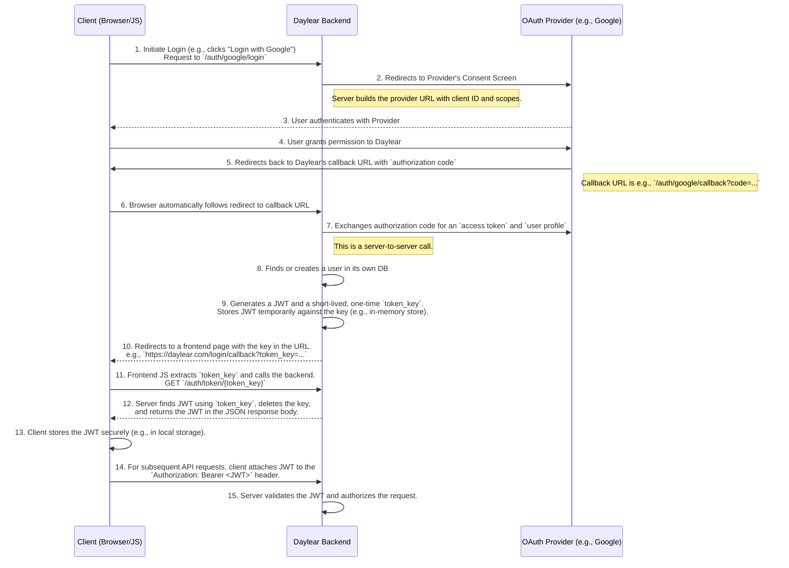

# Architecture Overview
## Primary/Driving/Server Adapters
The primary/driving/server adapter is the adapter that is responsible for handling the requests from the client. It should:
- extract the auth account
- convert to and from the domain types and request types
- return correct status codes
- verify that the request and response follow the api spec
  - grpc
    - check field behavior annotations on request and response
    - verify field masks and convert to domain version of the field masks
    - parse/format name and parent fields
    - convert to and from the domain types
    - parse page tokens
  - http
    - validate content type
    - validate max body size
- call the domain layer

## Domain
The domain layer is the layer that is responsible for the business logic of the application. It should:
- validate the incomming data
- check authorization based on the operation and the auth account
- set hard coded fields
- call secondary/driven/client adapters to get/set data

## Secondary/Driven/Client Adapters
The secondary/driven/client adapters are the adapters that are responsible for interacting with system outside of the domain layer. They would do things like:
- get/set data from the database
- get/set data from the file system
- get/set data from the cache
- get/set data from the message queue
- get/set data from the external service
- call external services
- call other microservices

They should always take and return the domain types, but they can convert to and from and types they need to interact with the system they are interacting with.

# Authentication Flow

The application uses an OAuth2 flow for authentication. Here is the step-by-step process for how a user authenticates and receives a JWT.

# Entities

## User
A user is the entity that represents a person who can log into the application. A user can be private or public:

*   **Public**: The user is visible in the user list. Their actual username is shown on publicly accessed content.
*   **Restricted**: The user is not visible in the user list. `Anonymous` should be shown as the username on publicly accessed content. They will show up in member and friend lists.
*   **Private**: The user is not visible in the user list. `Anonymous` should be shown as the username on publicly accessed content. They will show up in member and friend lists if the viewing user has access to the user
*   **Hidden**: The user is not visible in the user list. `Anonymous` should be shown as the username on publicly accessed content. They will not show up in member and friend lists unless the viewing user has admin access to the circle or the user is looking at their own friends list.

A user can only get, list other users that they have access to or users that are public.

A user can only edit, delete their own user.

## User Access
The entities that represent the access to a user. A user can have access to another user. If a user has access to a user, they can view the public and restricted content they have.

When an access is requested, it will create two records, one for both users. The permission level can only be set to `READ`. The state of both the accesses are set to `PENDING` when they are created. The states of the accesses can only be updated to `ACCEPTED` by the user that was requested.

*   `PERMISSION_LEVEL_UNSPECIFIED`: The user does not have access to the user.
*   `PERMISSION_LEVEL_PUBLIC`: The user can view the user's public content. This indicates that the user is public but the viewing user does not explicitly have access.
*   `PERMISSION_LEVEL_READ`: The user can view the user's public and restricted content.

## Recipe
A recipe is a collection of ingredients, instructions, and other information for preparing a dish. A recipe can be shared with a user or a circle. A recipe can be created by a user or a circle. A recipe can be public or private:

*   **Public**: The recipe is visible in the public recipe list.
*   **Restricted**: The recipe is visible only users that have: explicit access to the recipe or access to a circle that has access to the recipe.
*   **Private**: The recipe is only visible to users that have explicit access to the recipe.
*   **Hidden**: The recipe is only visible to the creator of the recipe.

When a user or circle view their own recipe's, they can get and list recipes that they have access to or recipes that are public. A user or circle can only edit, delete a recipe based on their permission level described in the `Recipe Access` section of this readme.

When a user or circle views another user or circle's recipe's, they can only get, list recipes the viewed user or circle has admin access to or recipes that are public the viewed user or circle has access to.

## Recipe Access
The entities that represent the access to a recipe. A user or circle can have access to a recipe. If a user or circle has access to a recipe, they can view it. If a circle has access to a recipe, all members of the circle can view it. Depending on the permission level, the user or circle can also edit the recipe and manage who can access the recipe. 

When the access is created, the state of the access is set to `PENDING`. If the access is created for a circle and the creating user has write level permissions for, it will be set to `ACCEPTED` on create. The state can be updated to `ACCEPTED` by the user or circle that is being granted access.

The possible states are:

*   `PENDING`: The access is pending.
*   `ACCEPTED`: The access is accepted.

When an access is created, the permission level is set but can be updated. Only a user or circle with write level permissions can update the permission level. A user or circle cannot grant permission to a recipe with a higher level than their own. 

The possible permission levels are:

*   `PERMISSION_LEVEL_UNSPECIFIED`: The user or circle does not have access to the recipe.
*   `PERMISSION_LEVEL_PUBLIC`: The user or circle can view the recipe. This indicates that the recipe is public but the user or circle does not explicitly have access to it.
*   `PERMISSION_LEVEL_READ`: The user or circle can view the recipe.
*   `PERMISSION_LEVEL_WRITE`: The user or circle can view, edit, and manage access to the recipe.
*   `PERMISSION_LEVEL_ADMIN`: The user or circle can view, edit, manage access to the recipe, and delete the recipe.

A user or circle can only get, list, create,update, delete their own recipe accesses or accesses to recipes that they have write permission to. A user can only accept their own access to a recipe.

## Circle
A circle is a group of entities and resources that a group of users can have access to. A circle can be created by a user. A circle can be public or private.

*   **Public**: The circle is visible in the public circle list.
*   **Restricted**: The circle is visible only users that have: explicit access to the circle or access to a user that has access to the circle.
*   **Private**: The circle is only visible to users that have explicit access to the circle.
*   **Hidden**: The circle is only visible to the admin of the circle and people that are direct members of the circle.

When a user views their own circles, they can get and list circles that they have access to or circles that are public. A user or circle can only edit, delete a circle based on their permission level described in the `Circle Access` section of this readme.

When a user views another user's circles, they can only get, list circles the viewed user has admin access to or circles that are public the viewed user has access to.

## Circle Access
The entities that represent the access to a circle. A user can have access to a circle. If a user has access to a circle, they can view it. Depending on the permission level, the user can also edit the circle and manage who can access the circle. If a user has explicit access to a circle, it is also said that they are a member of the circle.

When an access is created, the permission level is set but can be updated. The state of the access is set to `PENDING` when the access is created. The state can be updated to `ACCEPTED` by the user or circle that is being granted access. A user cannot grant permission to a circle with a higher level than their own. The possible permission levels are:

*   `PERMISSION_LEVEL_UNSPECIFIED`: The user does not have access to the circle.
*   `PERMISSION_LEVEL_PUBLIC`: The user can view the circle. This indicates that the circle is public but the user does not explicitly have access to it.
*   `PERMISSION_LEVEL_READ`: The user can view the circle.
*   `PERMISSION_LEVEL_WRITE`: The user can view, edit, and manage access to the circle.
*   `PERMISSION_LEVEL_ADMIN`: The user can view, edit, manage access to the circle, and delete the circle.

A user can only get, list, update, delete their own circle accesses or accesses to circles that they have write permission to.

A user can only create an access for a circle if they have write permission to the circle.

A user can only accept their own access to a circle.

# Database Schema

## Relationships and Join Tables
